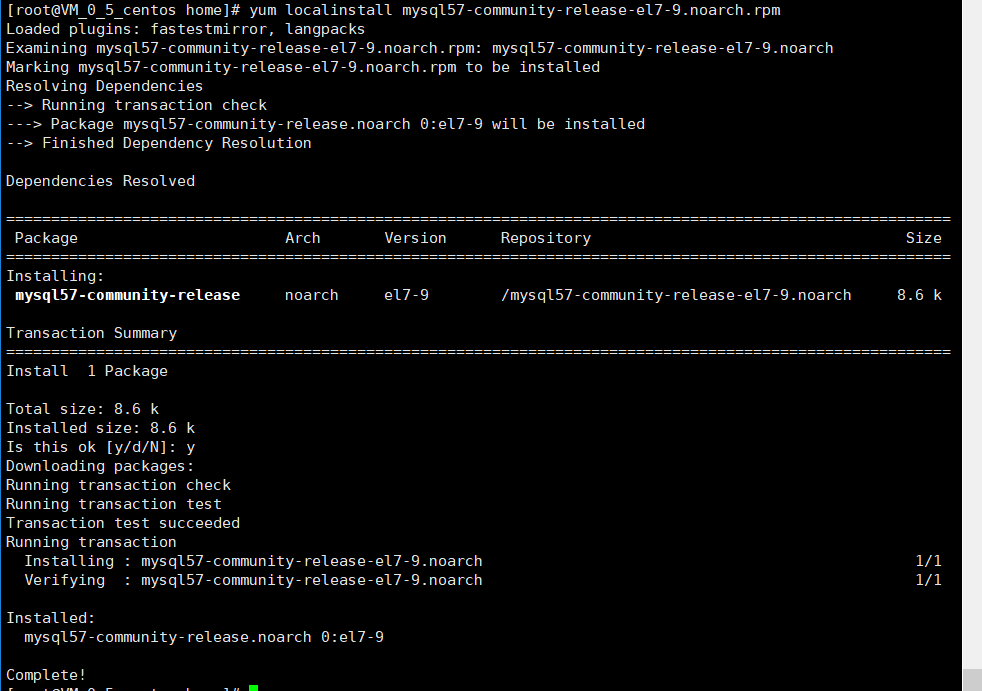
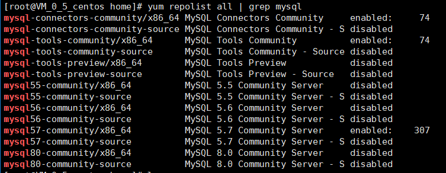
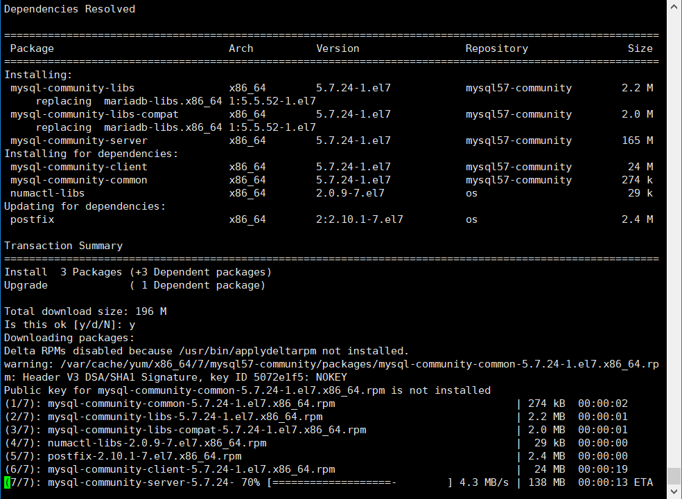
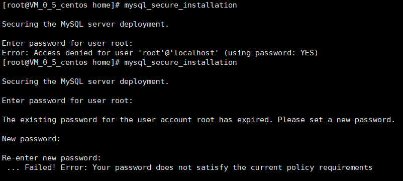
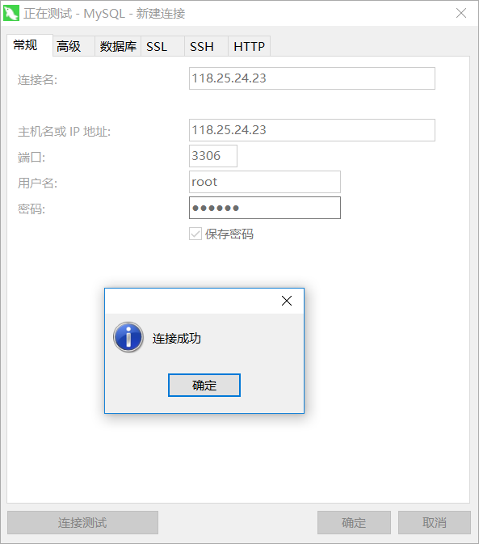

## CentOS 7.2 安装MySql 5.7

#### 1. 下载rpm包

```shell
[root@VM_0_5_centos home]# wget http://repo.mysql.com//mysql57-community-release-el7-9.noarch.rpm
```


#### 2. 下载安装软件源

```shell
[root@VM_0_5_centos home]# yum localinstall mysql57-community-release-el7-9.noarch.rpm 
```



#### 3. 查看系统是否添加该源

```shell
[root@VM_0_5_centos home]# yum repolist all | grep mysql
```



#### 4. 安装MySql

```shell
[root@VM_0_5_centos home]# yum install mysql-community-server.x86_64 
```



#### 5. 启动MySql Server

```shell
#启动Mysql
[root@VM_0_5_centos home]# systemctl start mysqld
#查看启动状态
[root@VM_0_5_centos home]# systemctl status mysqld
```


#### 6. 查看MySQL随机临时密码

```shell
[root@VM_0_5_centos home]# grep 'temporary password' /var/log/mysqld.log 
```


#### 7. 修改MySql密码

```shell
[root@VM_0_5_centos home]# mysql_secure_installation
```



> MySQL里带了一个密码验证的插件来防止密码设置过于简单。
>
> 密码要求：
>
> - 特殊字符
> - 大小写字母
> - 数字
> - 长度8位
>
> 实例密码：Fangchy1120.！

#### 8. 登录MySql修改密码

```shell
[root@VM_0_5_centos home]# mysql -uroot -p
```


> 原来MySQL5.6.6版本之后增加了密码强度验证插件validate_password，相关参数设置的较为严格。
> 使用了该插件会检查设置的密码是否符合当前设置的强度规则，若不满足则拒绝设置。影响的语句和函数有：create user,grant,set password,password(),old password。

1. **查看mysql全局参数**

```mysql
mysql> SHOW VARIABLES LIKE 'validate_password%';
+--------------------------------------+--------+
| Variable_name                        | Value  |
+--------------------------------------+--------+
| validate_password_check_user_name    | OFF    |
| validate_password_dictionary_file    |        |
| validate_password_length             | 8      |
| validate_password_mixed_case_count   | 1      |
| validate_password_number_count       | 1      |
| validate_password_policy             | MEDIUM |
| validate_password_special_char_count | 1      |
+--------------------------------------+--------+
7 rows in set (0.00 sec)
```

2. **参数解释**

   > - validate_password_dictionary_file
   >
   >   插件用于验证密码强度的字典文件路径。
   >
   > - validate_password_length
   >
   >   密码最小长度，参数默认为8，它有最小值的限制，最小值为：validate_password_number_count + validate_password_special_char_count + (2 * validate_password_mixed_case_count)
   >
   > - validate_password_mixed_case_count
   >
   >   密码至少要包含的小写字母个数和大写字母个数。
   >
   > - validate_password_number_count
   >
   >   密码至少要包含的数字个数。
   >
   > - validate_password_policy
   >
   >   密码强度检查等级，0/LOW、1/MEDIUM、2/STRONG。有以下取值：
   >
   >   | Policy      | Tests Performed                                              |
   >   | ----------- | ------------------------------------------------------------ |
   >   | 0 or LOW    | Length                                                       |
   >   | 1 or MEDIUM | Length; numeric, lowercase/uppercase, and special characters |
   >   | 2 or STRONG | Length; numeric, lowercase/uppercase, and special characters; dictionary file |
   >
   >   默认是1，即MEDIUM，所以刚开始设置的密码必须符合长度，且必须含有数字，小写或大写字母，特殊字符。
   >
   > - validate_password_special_char_count
   >
   >   密码至少要包含的特殊字符数。  

3. **修改上面的各项参数，全部执行成功**

```mysql
mysql> set global validate_password_policy=0;
Query OK, 0 rows affected (0.00 sec)
mysql> set global validate_password_mixed_case_count=0;
Query OK, 0 rows affected (0.00 sec)
mysql> set global validate_password_number_count=3;
Query OK, 0 rows affected (0.00 sec)
mysql> set global validate_password_special_char_count=0;
Query OK, 0 rows affected (0.00 sec)
mysql> set global validate_password_length=3;
Query OK, 0 rows affected (0.00 sec)
```

4. **查看修改后的参数**

```mysql
mysql> show variables like 'validate_password%';
+--------------------------------------+-------+
| Variable_name                        | Value |
+--------------------------------------+-------+
| validate_password_check_user_name    | OFF   |
| validate_password_dictionary_file    |       |
| validate_password_length             | 3     |
| validate_password_mixed_case_count   | 0     |
| validate_password_number_count       | 3     |
| validate_password_policy             | LOW   |
| validate_password_special_char_count | 0     |
+--------------------------------------+-------+
7 rows in set (0.00 sec)
```

5. **修改成简单密码**

```mysql
mysql> SET PASSWORD FOR 'root'@'localhost' = PASSWORD('123');
Query OK, 0 rows affected, 1 warning (0.00 sec)
```

6. **使用新密码登录**

```mysql
[root@VM_0_5_centos ~]# mysql -uroot -p
Enter password: 
Welcome to the MySQL monitor.  Commands end with ; or \g.
Your MySQL connection id is 16
Server version: 5.7.24 MySQL Community Server (GPL)

Copyright (c) 2000, 2018, Oracle and/or its affiliates. All rights reserved.

Oracle is a registered trademark of Oracle Corporation and/or its
affiliates. Other names may be trademarks of their respective
owners.

Type 'help;' or '\h' for help. Type '\c' to clear the current input statement.
```

7. 配置远程连接(腾讯云不需要配置端口)

```shell
#查看mysql端口
[root@VM_0_5_centos ~]# netstat -ntlp|grep 3306
tcp6       0      0 :::3306                 :::*                    LISTEN      13929/mysqld  
```

```mysql
#配置远程连接，赋予任何主机上以root身份访问数据的权限 
mysql> GRANT ALL PRIVILEGES ON *.* TO 'root'@'%' IDENTIFIED BY '123456' WITH GRANT OPTION;
Query OK, 0 rows affected, 1 warning (0.00 sec)
mysql> flush privileges;
Query OK, 0 rows affected (0.00 sec)
```



